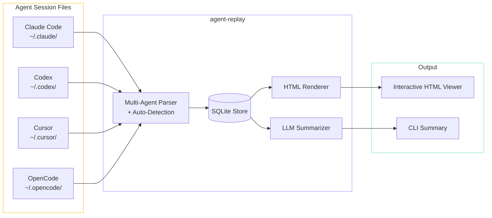

## Why

I've been using multiple AI coding agents daily — Claude Code, OpenCode, Cursor, occasionally Codex — and I found myself wanting to go back and review past sessions. What did I ask the agent to do? What approach did it take? Where did it go wrong? The native session logs exist, but they're in different formats, buried in different directories, and not pleasant to read.

Agent Replay was born from a simple itch: I want `git log` for my AI conversations. Browse, search, replay, and optionally get a summary of what happened.

## Architecture

The tool follows a straightforward pipeline: parse → store → render.



### Session Viewer

The generated HTML viewer shows each conversation turn with:

- Role indicators (user / assistant / system / tool)
- Syntax-highlighted code blocks
- Collapsible tool calls and their results
- Token usage and timing metadata
- Navigation between turns

### Key Design Decisions

**Multi-agent parser with auto-detection.** Each agent stores sessions differently — Claude Code uses JSONL, Codex uses its own format, Cursor stores in SQLite, OpenCode has yet another layout. Rather than forcing the user to specify the agent type, the parser examines file structure and format to auto-detect which agent produced the session.

**SQLite as the intermediate store.** After parsing, all sessions are normalized into a common schema in SQLite. This makes searching, filtering, and querying fast — "show me all Claude Code sessions from last week that touched files in `src/`" is just a SQL query.

**Static HTML output.** The `render` command generates a self-contained HTML file — no server needed. You can share it, archive it, or open it offline. The viewer is a single file with inlined CSS and JS.

**Pluggable LLM summarization.** The `summarize` command sends the session to any OpenAI-compatible API (OpenAI, Ollama, etc.) and returns a concise summary: what was the goal, what was done, what was the outcome. Useful for building a personal changelog of AI-assisted work.

## CLI Interface

```
agent-replay list                    # browse all sessions
agent-replay list --agent claude     # filter by agent
agent-replay replay <session-id>     # open in browser
agent-replay render <session-id>     # generate HTML file
agent-replay summarize <session-id>  # LLM-powered summary
```

## How It's Built

The parser layer was the most labor-intensive part — reverse-engineering each agent's session format and handling edge cases (interrupted sessions, malformed JSON, sessions with binary tool outputs). Each agent gets its own parser module, and a detector function examines file paths and content to route to the right one.

The HTML renderer uses template literals — no framework, just string interpolation into a well-structured HTML document. For something that generates static files, this is simpler and faster than pulling in React or any templating engine.

Configuration lives in `.agent-replay.json` at the project root: custom session directories, default LLM endpoint, output preferences.
