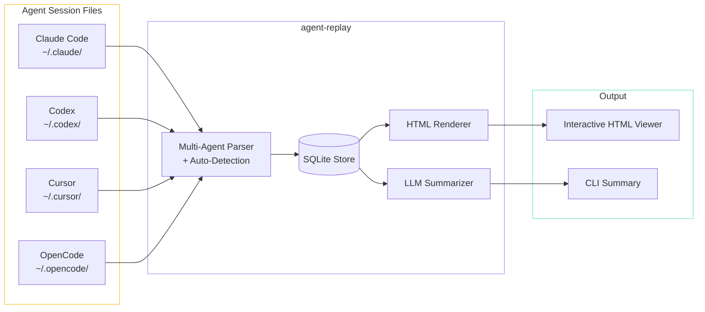

## 为什么

我每天都在使用多个 AI 编程 Agent——Claude Code、OpenCode、Cursor，偶尔还有 Codex——经常想回顾之前的会话。我让 Agent 做了什么？它采取了什么方案？哪里出了问题？原生的会话日志确实存在，但格式各异，散落在不同目录里，读起来也不方便。

Agent Replay 源于一个简单的需求：我想要 AI 对话的 `git log`。可以浏览、搜索、回放，还能选择性地获取会话摘要。

## 架构

工具遵循一个简洁的流水线：解析 -> 存储 -> 渲染。



### 会话查看器

生成的 HTML 查看器展示每一轮对话，包含：

- 角色标识（user / assistant / system / tool）
- 语法高亮的代码块
- 可折叠的工具调用及其结果
- Token 使用量和时间元数据
- 轮次间的导航

### 关键设计决策

**多 Agent 解析器与自动检测。** 每个 Agent 存储会话的方式都不同——Claude Code 使用 JSONL，Codex 有自己的格式，Cursor 存储在 SQLite 中，OpenCode 又是另一种布局。解析器不要求用户指定 Agent 类型，而是通过检查文件结构和格式来自动检测会话来源。

**SQLite 作为中间存储。** 解析后，所有会话被规范化为 SQLite 中的统一 schema。这使得搜索、过滤和查询变得很快——"显示上周所有涉及 `src/` 目录的 Claude Code 会话"只需一条 SQL 查询。

**静态 HTML 输出。** `render` 命令生成一个自包含的 HTML 文件——无需服务器。可以分享、归档或离线打开。查看器是单个文件，内联了 CSS 和 JS。

**可插拔的 LLM 摘要。** `summarize` 命令将会话发送到任何 OpenAI 兼容的 API（OpenAI、Ollama 等），返回一个简洁的摘要：目标是什么、做了什么、结果如何。适合用来构建 AI 辅助工作的个人变更日志。

## CLI 接口

```
agent-replay list                    # 浏览所有会话
agent-replay list --agent claude     # 按 Agent 筛选
agent-replay replay <session-id>     # 在浏览器中打开
agent-replay render <session-id>     # 生成 HTML 文件
agent-replay summarize <session-id>  # LLM 驱动的摘要
```

## 技术实现

解析器层是最费时间的部分——逆向工程每个 Agent 的会话格式，处理各种边界情况（中断的会话、格式错误的 JSON、包含二进制工具输出的会话）。每个 Agent 有独立的解析模块，一个检测函数通过检查文件路径和内容来路由到正确的解析器。

HTML 渲染器使用模板字面量——没有框架，只是把字符串插值到一个结构良好的 HTML 文档中。对于生成静态文件的场景，这比引入 React 或任何模板引擎都更简单、更快。

配置存放在项目根目录的 `.agent-replay.json` 中：自定义会话目录、默认 LLM 端点、输出偏好设置。
