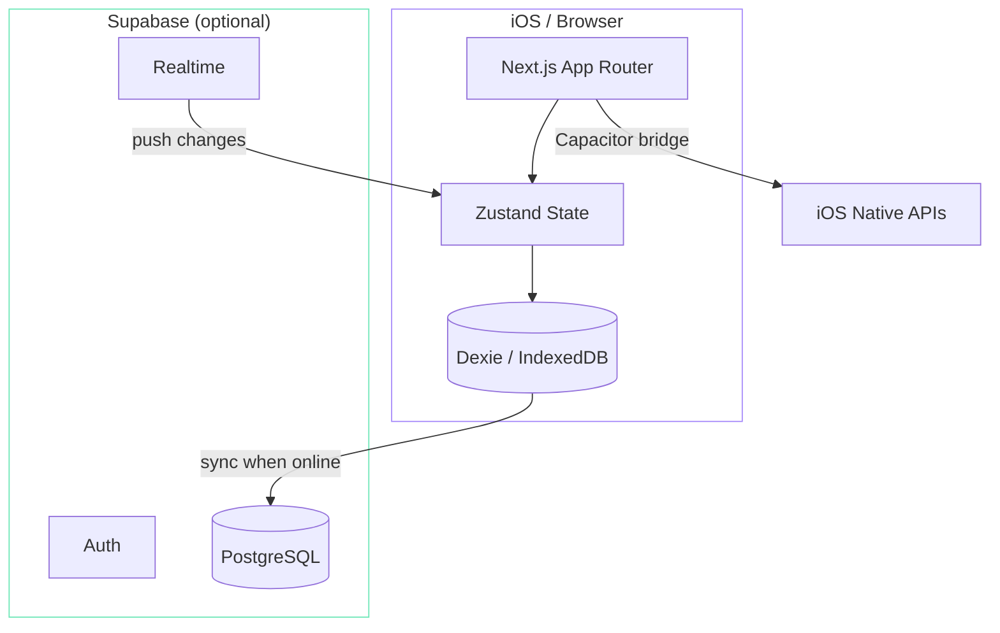
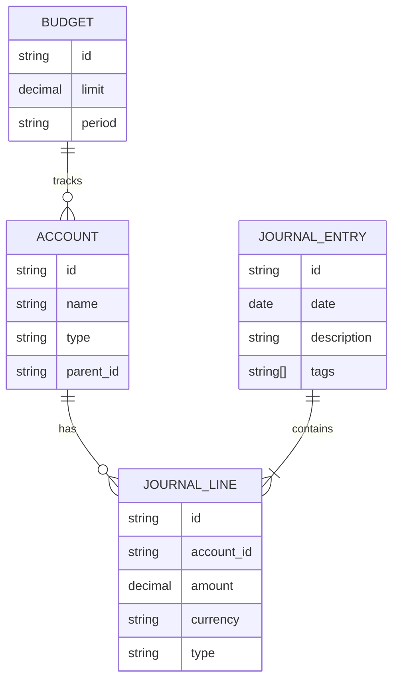

## Why

I tried dozens of personal finance apps and none of them fit. Mint was shut down. YNAB has a subscription. Most Chinese apps are ad-laden or require too many permissions. What I wanted was simple: a double-entry ledger that matches how I actually think about money, runs offline, syncs across devices when convenient, and doesn't sell my financial data.

This is the project I wrote about in my blog post on [building software with AI agents](/blog/ai-agent-build-software) — the one that went from "I want this" to "I'm using this daily" in a single evening.

## Architecture

The key architectural decision is **offline-first with optional cloud sync**. The app works entirely from IndexedDB on the device. Supabase sync is an opt-in layer for cross-device access.

### Data Model

The app uses proper double-entry bookkeeping. Every transaction is a journal entry with balanced debit/credit lines.

### Key Design Decisions

**Double-entry over single-entry.** Most personal finance apps use single-entry — you log "spent $50 on groceries" and that's it. Double-entry means every transaction touches two accounts (e.g., debit "Groceries", credit "Bank Account"). It's slightly more work to set up, but it means your books always balance, and you can generate proper financial statements.

**Dexie for local storage.** Dexie wraps IndexedDB with a clean, Promise-based API and handles schema migrations gracefully. For an offline-first app where all reads/writes are local, it's significantly faster than hitting a remote database.

**Capacitor for iOS.** Rather than building a native app, the Next.js web app is wrapped with Capacitor. This gives access to native APIs (biometric auth, notifications for budget alerts) while keeping a single codebase. The trade-off is performance — it's not as smooth as SwiftUI — but for a personal tool, it's more than good enough.

**Budget alerts.** When spending in a category approaches or exceeds the monthly budget, the app shows a visual warning on the dashboard. Simple, but it's the feature that actually changed my spending behavior.

## How It's Built

This was the project where I first experienced the "describe what you want, watch it appear" workflow with Claude Code. The initial data model, CRUD operations, and dashboard layout were generated in one session. I spent most of my manual effort on:

- Getting Dexie ↔ Supabase sync conflict resolution right (last-write-wins with soft deletes)
- Tuning Framer Motion animations to feel responsive but not distracting
- The Capacitor iOS build pipeline (code signing, provisioning profiles — the usual Apple pain)

The CSV/XLSX import was useful for migrating data from my previous app. The i18n setup (next-intl) supports Chinese and English — mostly because I switch between both depending on context.
