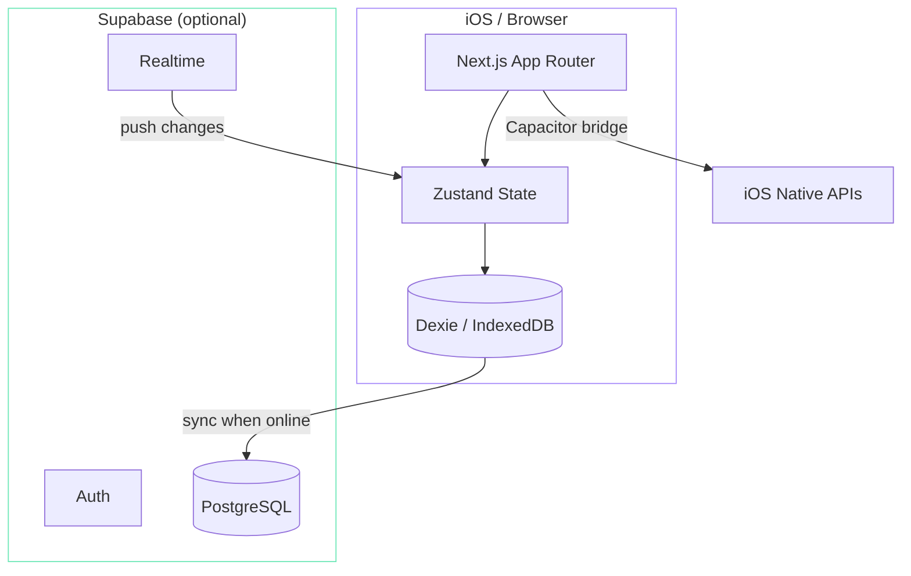
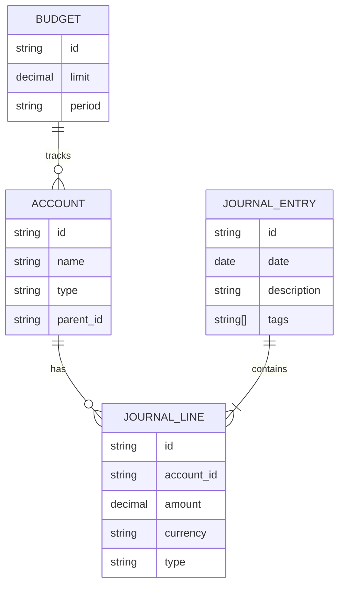

## 为什么

我试过几十款个人记账应用，没有一个合适的。Mint 停止运营了，YNAB 要订阅付费，大多数国内应用广告满天飞或者要一堆权限。我想要的很简单：一个符合我对金钱思考方式的复式记账工具，能离线使用，需要时可以跨设备同步，而且不会出卖我的财务数据。

这就是我在博客文章[用 AI Agent 构建软件](/blog/ai-agent-build-software)中写到的项目——从"我想要这个"到"我每天都在用"只花了一个晚上。

## 架构

最关键的架构决策是**离线优先，云同步可选**。应用完全基于设备上的 IndexedDB 运行。Supabase 同步是一个可选的附加层，用于跨设备访问。

### 数据模型

应用采用规范的复式记账。每笔交易都是一条日记账分录，包含借贷平衡的明细行。

### 关键设计决策

**复式记账而非单式记账。** 大多数个人记账应用使用单式记账——你记下"在杂货店花了 50 元"就完事了。复式记账意味着每笔交易涉及两个账户（例如，借记"食品杂货"、贷记"银行账户"）。初始设置稍微多一点工作，但这保证了账目始终平衡，而且可以生成规范的财务报表。

**使用 Dexie 作为本地存储。** Dexie 用简洁的 Promise API 封装了 IndexedDB，并且能优雅地处理数据库迁移。对于一个所有读写都在本地的离线优先应用，它比访问远程数据库快得多。

**使用 Capacitor 适配 iOS。** 没有单独写原生应用，而是用 Capacitor 封装 Next.js Web 应用。这样既能访问原生 API（生物识别认证、预算提醒通知），又能保持单一代码库。代价是性能——不如 SwiftUI 流畅——但作为个人工具完全够用。

**预算提醒。** 当某个类别的支出接近或超过月度预算时，应用会在仪表盘上显示视觉警告。功能很简单，但这确实改变了我的消费行为。

## 技术实现

这是我第一次体验到"描述你想要什么，看着它出现"的 Claude Code 工作流的项目。初始的数据模型、CRUD 操作和仪表盘布局在一个 session 里就生成好了。我手动花时间最多的地方是：

- 处理 Dexie 和 Supabase 之间的同步冲突解决（采用最后写入胜出策略加软删除）
- 调试 Framer Motion 动画，使其响应迅速但不会让人分心
- Capacitor 的 iOS 构建流程（代码签名、配置文件——Apple 开发的老大难问题）

CSV/XLSX 导入功能在从之前的应用迁移数据时很有用。国际化配置（next-intl）支持中英双语——主要因为我会根据场景在两种语言之间切换。
