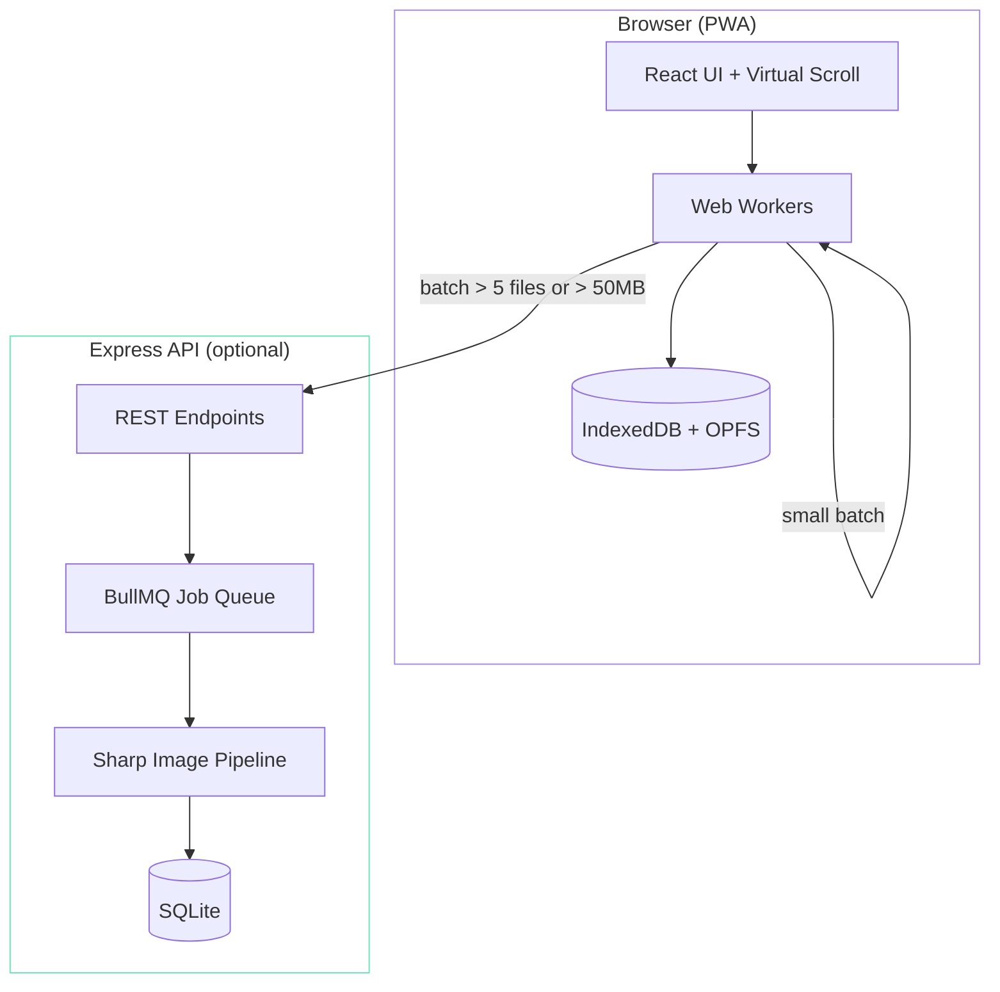

## Why

Every time I come back from a photography trip, I face the same problem: hundreds of similar shots, and I need to quickly pick the best ones. Lightroom's compare mode is slow. Google Photos doesn't understand RAW. And I don't want my photos uploaded anywhere.

I wanted a tool that could: group visually similar photos automatically, help me pick the sharpest one in each group, handle RAW files natively, and keep everything local.

## Architecture

The app uses a hybrid processing model — the browser does all the work by default, but heavy batches automatically fall back to server-side processing.

### Processing Pipeline

When photos are imported, they go through a multi-stage pipeline:

1. **Metadata extraction** — EXIF data (camera, lens, focal length, GPS) via exiftool-vendored
2. **Thumbnail generation** — multiple sizes for responsive gallery display
3. **Perceptual hashing** — computes a 64-bit pHash for each image (~900 images/sec throughput)
4. **Similarity grouping** — clusters photos by Hamming distance on their hashes
5. **Quality scoring** — ranks within each group by sharpness (Laplacian variance), exposure, and noise

### Key Design Decisions

**Offline-first with optional server.** The PWA works entirely in the browser — IndexedDB for metadata, OPFS for image data. The Express backend only activates for large imports where browser processing would be too slow. This means the app works on a plane, in a cabin, wherever.

**Virtual scrolling.** Galleries can have thousands of photos. Using react-window for virtualized rendering keeps the DOM lean — only visible photos are mounted. Gallery load stays under 500ms for 1000+ photos.

**RAW support.** The app handles 40+ RAW formats (Canon CR2/CR3, Nikon NEF, Sony ARW, Fuji RAF, etc.) by extracting embedded previews for display and passing full data to Sharp for processing.

## How It's Built

This was one of my first projects built heavily with AI assistance. The initial scaffold — React components, Express routes, BullMQ job setup — was generated through Claude Code in about two evenings. The perceptual hashing and image quality scoring algorithms required more hands-on work, since getting the thresholds right for "similar but not identical" grouping needed a lot of iterating with real photo sets.

The PWA configuration (service workers, OPFS access, offline caching) was the trickiest part. Browser APIs for local file access are still evolving, and there were subtle differences between Chrome and Safari that required careful testing.
