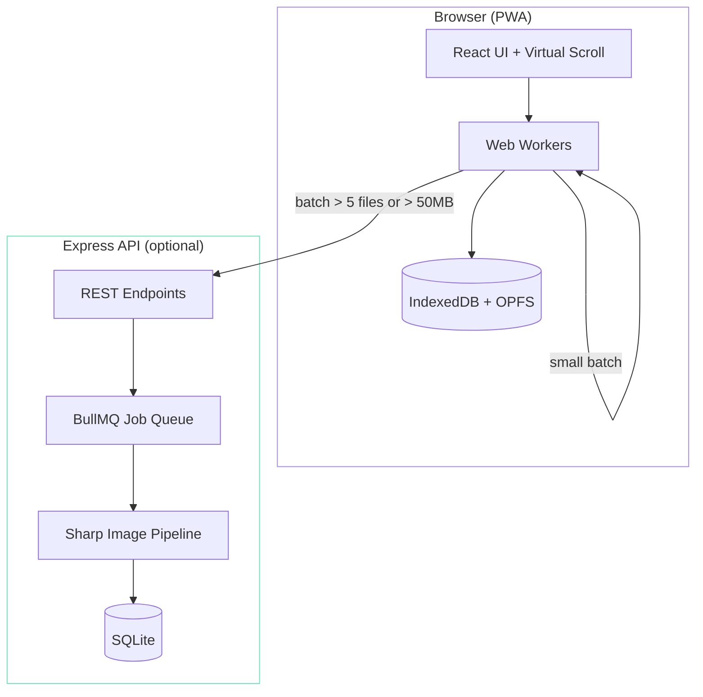
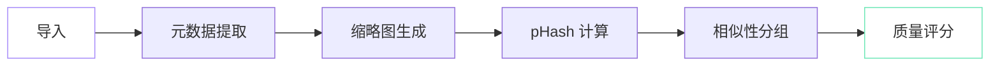

## 为什么

每次外拍回来，我都面对同样的问题：几百张相似的照片，需要快速挑出最好的几张。Lightroom 的对比模式太慢，Google Photos 不支持 RAW，而且我不想把照片上传到任何地方。

我需要一个工具，能够：自动将视觉相似的照片分组、帮我挑出每组中最清晰的一张、原生处理 RAW 文件，并且所有数据都留在本地。

## 架构

应用采用混合处理模型——默认情况下浏览器完成所有工作，但大批量任务会自动回退到服务端处理。

### 处理流水线

照片导入后，会经过一个多阶段的处理流水线：

1. **元数据提取** — 通过 exiftool-vendored 读取 EXIF 数据（相机、镜头、焦距、GPS）
2. **缩略图生成** — 生成多种尺寸，用于响应式画廊展示
3. **感知哈希** — 为每张图片计算 64 位 pHash（吞吐量约 900 张/秒）
4. **相似性分组** — 根据哈希值的汉明距离对照片进行聚类
5. **质量评分** — 在每个分组内按清晰度（拉普拉斯方差）、曝光和噪点进行排序

### 关键设计决策

**离线优先，服务端可选。** PWA 完全在浏览器中运行——IndexedDB 存储元数据，OPFS 存储图片数据。Express 后端仅在大批量导入时启用，因为此时浏览器处理速度不够。这意味着在飞机上、小木屋里，任何地方都能用。

**虚拟滚动。** 画廊可能有数千张照片。使用 react-window 实现虚拟化渲染，保持 DOM 精简——只挂载可见的照片。1000+ 张照片的画廊加载时间控制在 500ms 以内。

**RAW 格式支持。** 应用支持 40+ 种 RAW 格式（Canon CR2/CR3、Nikon NEF、Sony ARW、Fuji RAF 等），通过提取内嵌预览用于显示，同时将完整数据传递给 Sharp 进行处理。

## 技术实现

这是我最早大量借助 AI 辅助构建的项目之一。初始的脚手架——React 组件、Express 路由、BullMQ 任务配置——通过 Claude Code 在大约两个晚上就生成完成了。感知哈希和图像质量评分算法需要更多手动调试，因为要把"相似但不完全相同"的分组阈值调到合适，需要用大量真实照片反复迭代。

PWA 的配置（Service Worker、OPFS 访问、离线缓存）是最棘手的部分。浏览器的本地文件访问 API 仍在演进中，Chrome 和 Safari 之间存在一些微妙的差异，需要仔细测试。
