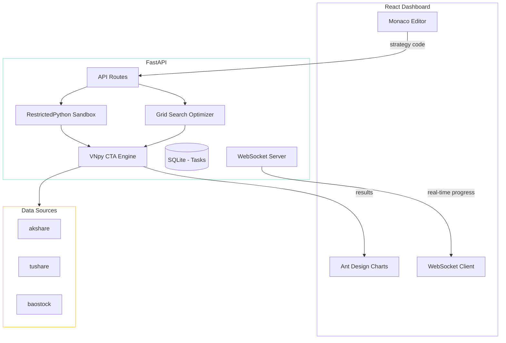
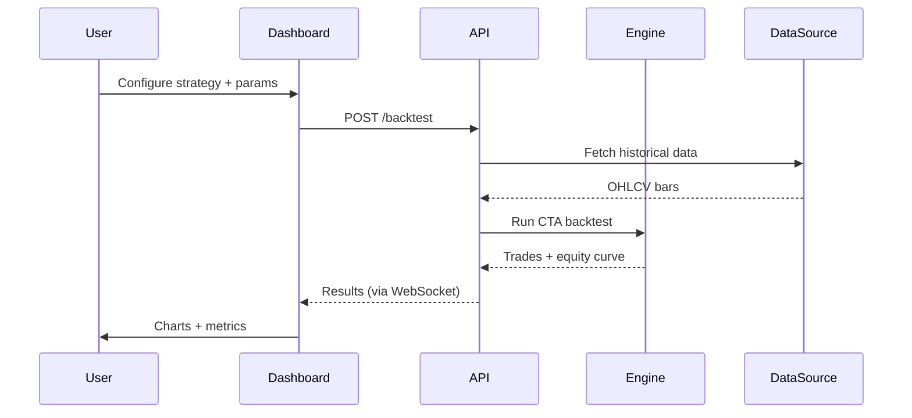

## Why

I wanted a self-hosted platform to test CTA (Commodity Trading Advisor) strategies on A-share data without paying for expensive commercial tools. Most open-source backtesting frameworks are either CLI-only or require deep Python knowledge to configure. I wanted something with a proper web dashboard — visual strategy comparison, parameter sweeps, and a code editor to write custom strategies without leaving the browser.

## Architecture

The platform is split into a FastAPI backend (running the VNpy backtesting engine) and a React frontend for interactive analysis.

### Backtesting Flow

### Key Design Decisions

**11 built-in strategies.** DMA, RSI, MACD, Bollinger Bands, ATR, KDJ, CCI, DMI, TRIX, WR, and DualThrust — covering the most common CTA patterns. Each strategy uses the same VNpy `CtaTemplate` interface, so switching between them is just changing a config.

**Grid search with out-of-sample validation.** Parameter optimization splits data into in-sample and out-of-sample periods. This guards against overfitting — a strategy that only works on training data is useless.

**Sandboxed custom strategies.** Users can write Python strategies in the Monaco editor, and the backend executes them via RestrictedPython. This prevents filesystem/network access from user code while still giving full access to the VNpy strategy API.

**WebSocket progress tracking.** Backtests and optimizations can take minutes. Rather than polling, the frontend opens a WebSocket connection and receives real-time updates — current progress, partial results, and estimated time remaining.

## How It's Built

The backend was straightforward — FastAPI wrapping VNpy's existing CTA engine with some async glue for the task queue. The interesting part was building the parameter optimizer: running multiple backtests in parallel while streaming progress updates through WebSocket.

The frontend was built with Claude Code in a couple of sessions. Ant Design's dark theme plus Monaco Editor gave it a professional look out of the box. The strategy comparison view — overlaying multiple equity curves on the same chart — took some manual tuning to get the axis scaling and legend placement right.

Data sourcing is pluggable: akshare is the default (no API key needed), with optional adapters for tushare and baostock for users who have accounts.
