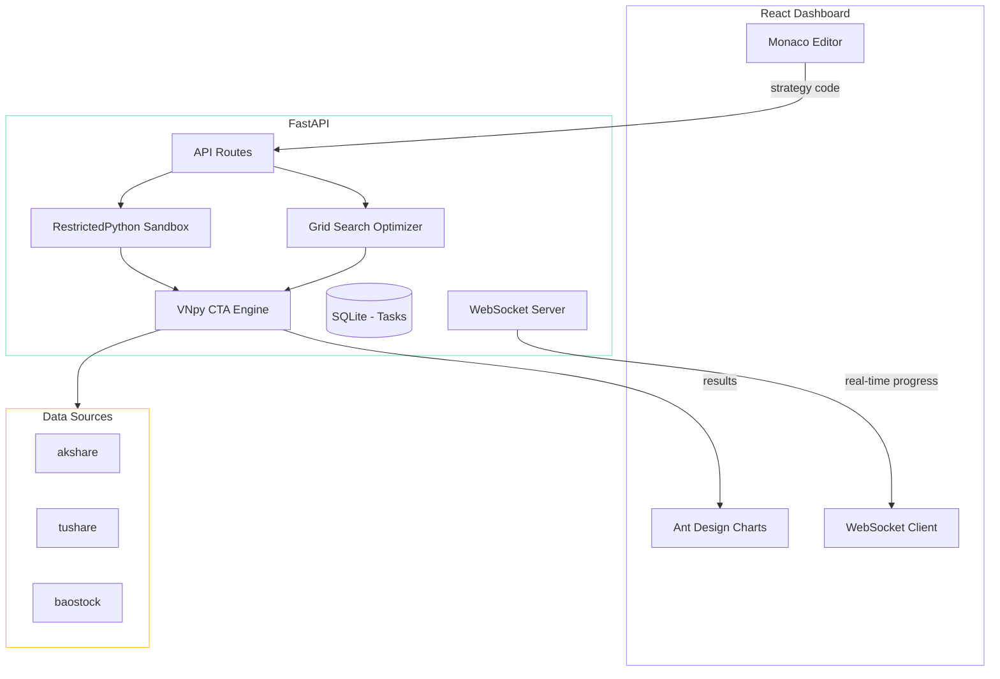
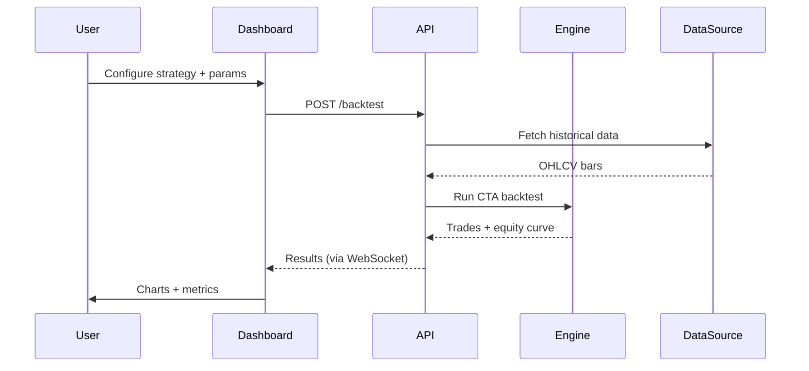

## 为什么

我想要一个自托管的平台来测试 A 股的 CTA（商品交易顾问）策略，而不用花钱买昂贵的商业工具。大多数开源回测框架要么只有命令行界面，要么需要很深的 Python 功底才能配置。我想要的是一个带有完整 Web 仪表盘的平台——可以可视化比较策略、进行参数扫描，还能在浏览器里直接写自定义策略。

## 架构

平台分为 FastAPI 后端（运行 VNpy 回测引擎）和 React 前端（用于交互式分析）。

### 回测流程

### 关键设计决策

**11 个内置策略。** DMA、RSI、MACD、布林带、ATR、KDJ、CCI、DMI、TRIX、WR 和 DualThrust——覆盖了最常见的 CTA 策略模式。每个策略都使用相同的 VNpy `CtaTemplate` 接口，切换策略只需修改配置即可。

**网格搜索与样本外验证。** 参数优化会将数据分为样本内和样本外两个时间段。这可以防止过拟合——一个只在训练数据上有效的策略毫无价值。

**沙箱化的自定义策略。** 用户可以在 Monaco 编辑器中编写 Python 策略，后端通过 RestrictedPython 执行。这在给予用户完整 VNpy 策略 API 访问权限的同时，阻止了用户代码对文件系统和网络的访问。

**WebSocket 进度追踪。** 回测和优化可能需要数分钟。前端通过 WebSocket 连接接收实时更新——当前进度、部分结果和预计剩余时间，无需轮询。

## 技术实现

后端比较直接——用 FastAPI 封装 VNpy 现有的 CTA 引擎，加上一些异步胶水代码来处理任务队列。有意思的部分是构建参数优化器：并行运行多个回测，同时通过 WebSocket 流式推送进度更新。

前端是用 Claude Code 在几个 session 里搭建的。Ant Design 的暗色主题加上 Monaco Editor，开箱即用就有了专业的外观。策略对比视图——在同一张图表上叠加多条权益曲线——在坐标轴缩放和图例位置上花了一些手动调整的时间。

数据源是可插拔的：akshare 是默认选项（无需 API 密钥），同时提供了 tushare 和 baostock 的可选适配器，供有账户的用户使用。
